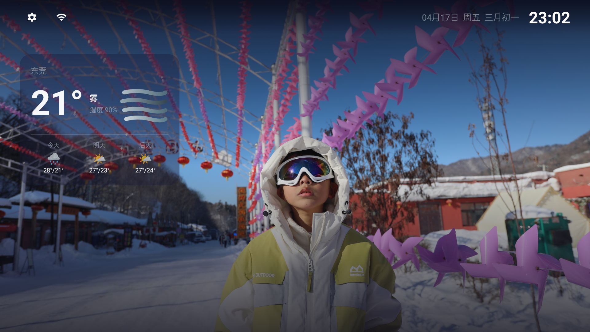
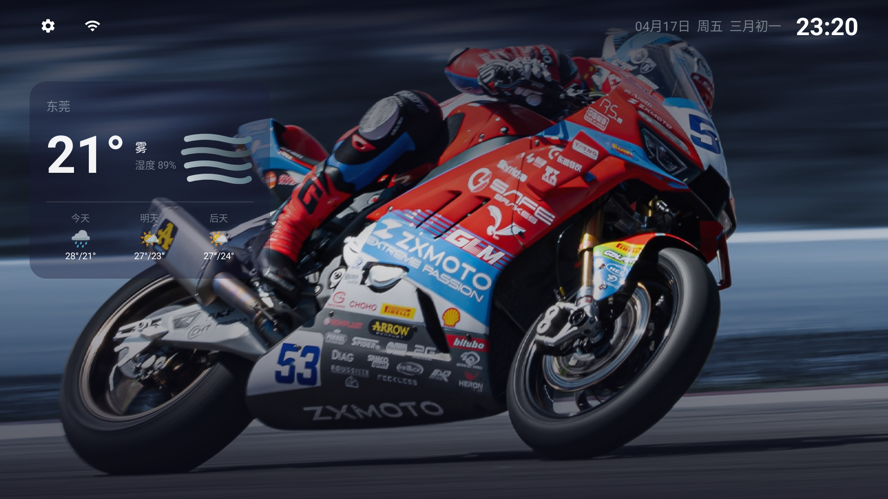
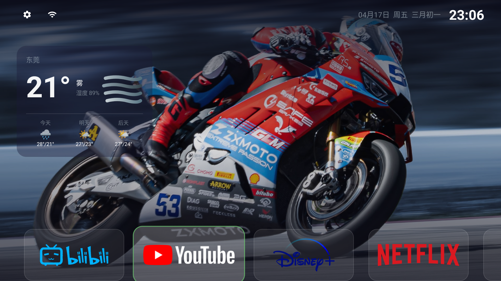
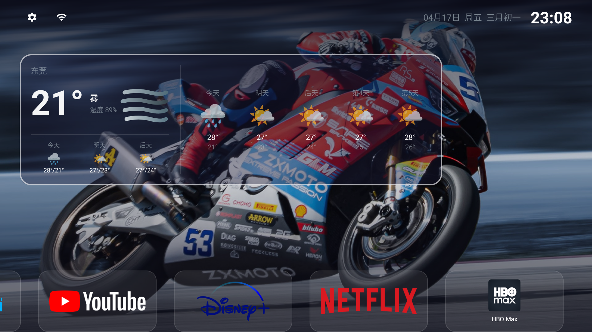
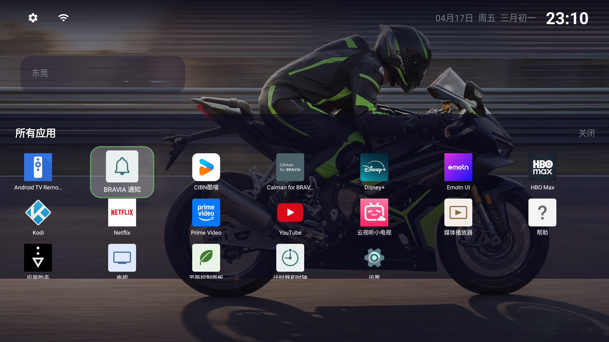
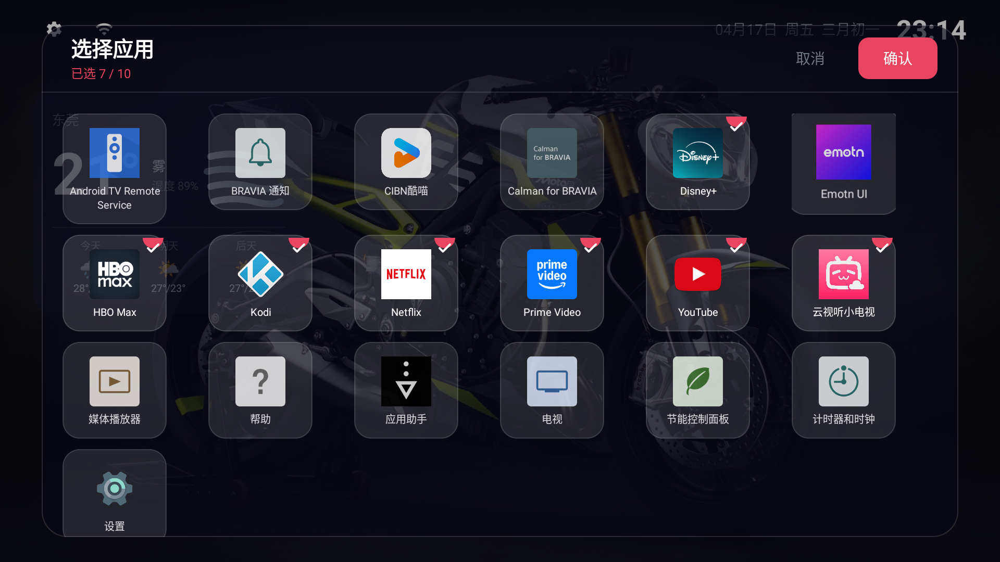
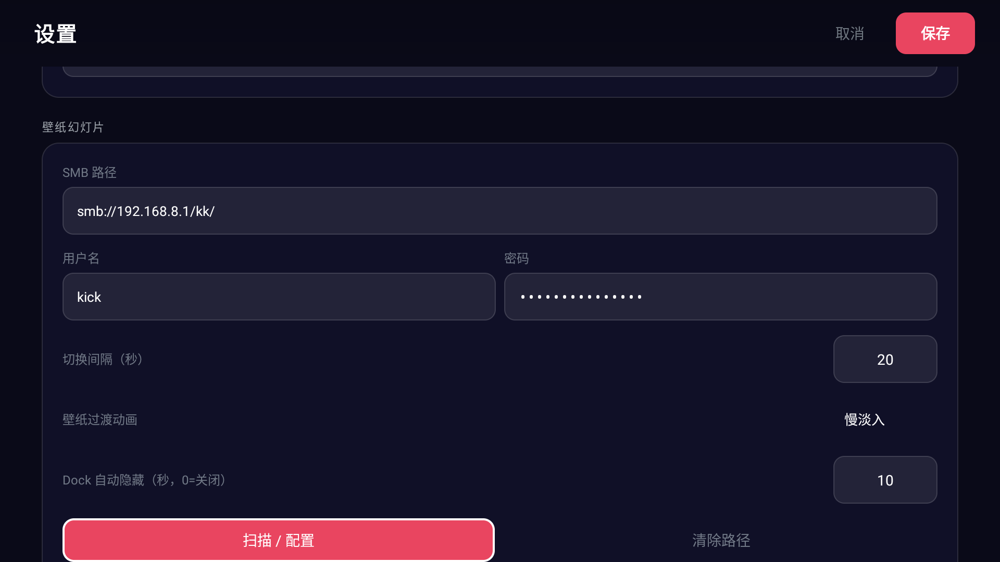

# KK TV Launcher

一款为 **Android TV（Sony BRAVIA 等）** 定制的启动器，支持壁纸轮播、Dock 快捷应用、实时天气、自定义透明图标等功能。



> 完整运行效果见 [`demo/README.md`](demo/README.md)（13 张实拍截图，按使用场景分类）。

---

## 功能特性

- 🖼 **壁纸轮播**：支持本地内置壁纸 / SMB / WebDAV / HTTP 目录随机轮播；竖屏图片自动双拼横向铺满
- 🌤 **实时天气**：接入[和风天气](https://dev.qweather.com/)，显示当前温度、天气图标及未来两天预报
- 🎛 **Dock 应用栏**：底部可自定义应用快捷方式，支持横幅 Banner / 自定义透明 PNG 图标 / 玻璃拟态样式
- 📱 **全部应用抽屉**：遥控器向下滑动展开，支持网格浏览
- ⚙️ **设置界面**：全局透明度、焦点边框颜色、壁纸来源、天气城市、SMB 凭据等均可配置
- 🔒 **后台保活**：前台 Service 保持网络心跳，确保熄屏后 ADB 可连接

---

## 快速开始

### 1. 克隆项目

```bash
git clone https://github.com/jeskick/com.kk.tvluncher.git
cd com.kk.tvluncher
```

### 2. 配置签名

在项目根目录创建 `signing.properties`（已加入 `.gitignore`，不会提交）：

```properties
storeFile=your_keystore.jks
storePassword=your_store_password
keyAlias=your_key_alias
keyPassword=your_key_password
```

或通过环境变量：

```bash
export STORE_PASSWORD=your_store_password
export KEY_PASSWORD=your_key_password
```

### 3. 配置本地参数（可选）

在项目根目录创建 `local.properties`（已加入 `.gitignore`，不会提交），追加以下内容：

```properties
# SMB 壁纸目录
smb.dir=smb://192.168.x.x/share/
smb.user=your_smb_username
smb.pass=your_smb_password

# 和风天气（https://dev.qweather.com/）
weather.key=your_qweather_api_key
weather.city=北京
```

> 不配置也没关系，App 首次启动后在**设置界面**手动填写同样有效，填写后会永久保存。

### 4. 编译

```bash
./gradlew assembleRelease
```

### 5. 安装到 Android TV

```bash
adb install -r app/build/outputs/apk/release/app-release.apk
```

---

## 设置说明

| 设置项 | 说明 |
|--------|------|
| 天气城市 | 输入城市名（如：北京、上海）|
| 天气 API Key | 和风天气开发者 Key |
| SMB 壁纸路径 | 格式：`smb://NAS_IP/share/` |
| SMB 用户名/密码 | NAS 访问凭据 |
| 幻灯片间隔 | 壁纸切换间隔（秒）|
| 全局透明度 | 天气卡片等 UI 元素透明度 |
| 焦点边框颜色 | 遥控器选中时的边框颜色 |
| 内置壁纸 | 随机切换 / 随机SMB目录 / 单张固定 |

---

## 自定义应用图标

将透明 PNG 文件放入 `app/src/main/assets/icons/`，文件名为对应包名：

```
assets/icons/com.google.android.youtube.tv.png
assets/icons/com.netflix.ninja.png
assets/icons/com.disney.disneyplus.png
...
```

---

## 界面预览

| 场景 | 截图 |
|------|------|
| **默认桌面**（无焦点，Dock 隐藏） |  |
| **Dock 唤起** · 横幅 Banner 图标 |  |
| **天气卡片**·获得焦点右侧展开 5 日预报 |  |
| **全部应用抽屉**·网格浏览 |  |
| **选择应用**·多选 Dock 快捷方式 |  |
| **设置**·壁纸幻灯片与过渡动画 |  |

更多场景（不同壁纸轮播、内置壁纸、Dock 与天气并存等）请见 [`demo/README.md`](demo/README.md)。

---

## 环境要求

- Android TV，SDK 31+（Android 12+）
- JDK 17
- Android SDK Build Tools 34+
- Gradle 8.6+

---

## License

MIT License
