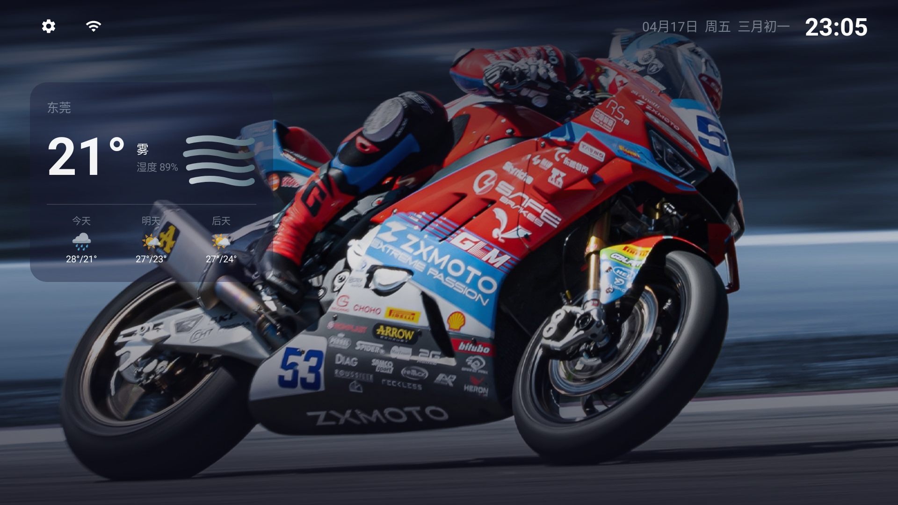
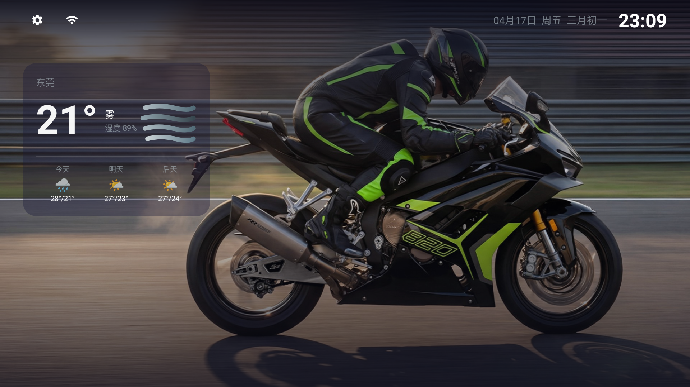
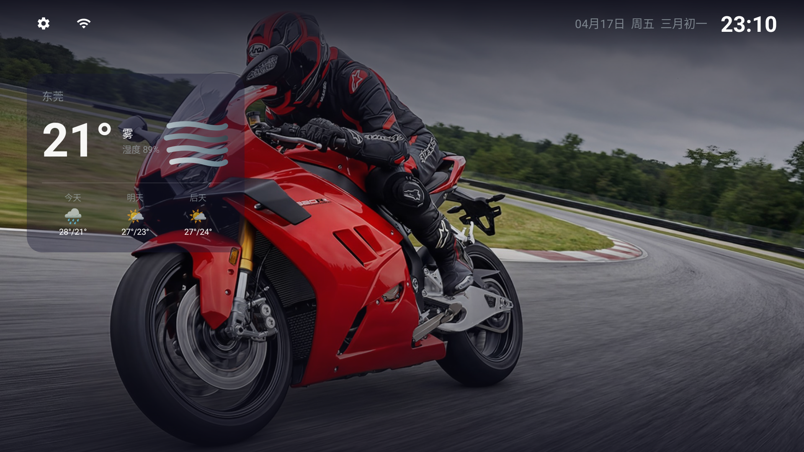
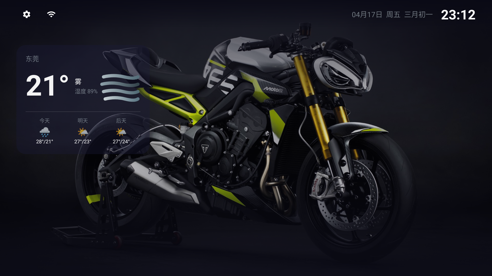
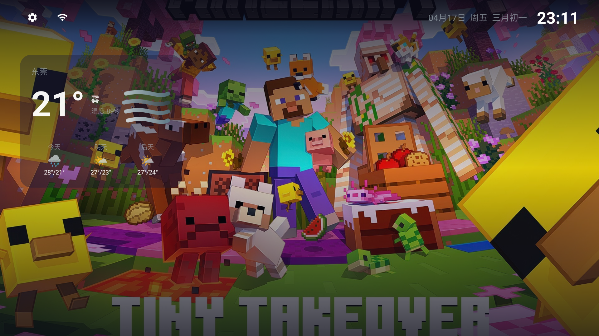
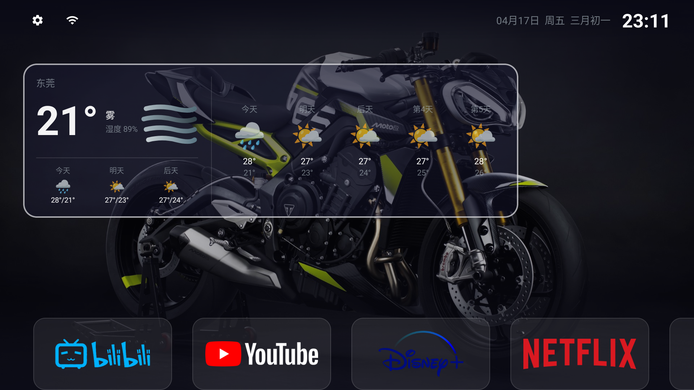

# 运行效果预览 / Screenshots

> 采集自 Sony BRAVIA 4K AE2 (Android 12 / SDK 31)，实拍截图。
> 为对照遥控器操作流程，截图按使用场景归类展示。

---

## 一、桌面默认态（无焦点 · Dock 隐藏）

启动后的常态：纯背景 + 顶栏（设置 / WiFi / 日期时间 / 农历）+ 左上角天气卡片。
**默认没有焦点**，所有图标均隐藏，视觉干净；任意按键或连按 HOME 两次即可唤出 Dock。

### 1.1 冬季人像（SMB 远程壁纸）

- 顶栏左上：**设置**图标 · **WiFi**图标（焦点时展开文字）
- 顶栏右上：`04月17日 周五 三月初一 23:02`（公历 + 星期 + **农历**）
- 天气卡片：`东莞 21° 雾 湿度 90%` + 今明后三天预报缩略
- 背景：SMB 目录随机图

### 1.2 摩托 · 红蓝 53 号

同一桌面在 20 秒后自动切换到下一张 SMB 壁纸，触发**Glide 淡入动画**（可在设置中切"无 / 淡入 / 慢淡入"）。

### 1.3 摩托 · 黑绿 Ninja

天气卡片在**深色壁纸**上仍保持可读性（玻璃拟态：半透明 + 淡边框 + 模糊感）。

### 1.4 摩托 · 红色 Ducati

### 1.5 摩托 · 灰黄 Moto

### 1.6 内置壁纸 · Minecraft Tiny Takeover

当 SMB 不可达或用户在设置里选"随机内置壁纸"时，从 `app/src/main/assets/wallpapers/` 随机挑一张。
**内置壁纸随 APK 打包**，即使断网也有兜底。

### 1.7 桌面·干净态（摩托红蓝）

---

## 二、Dock 应用栏（底部快捷应用）

### 2.1 Dock 显示 · YouTube 聚焦

- 底部四个常用应用 banner：**Bilibili / YouTube / Disney+ / Netflix**
- 绿色焦点框 = 当前遥控器焦点
- 触发方式：
  - 任意遥控器按键 → 滑入动画，焦点落到第 1 个 app
  - **HOME 连按两下**（≤ 320ms）→ 同上
- 左右方向键：**循环导航**（最左再按左 → 跳到最右）
- 无操作 10 秒（可配置）后自动滑出隐藏

> Dock 图标优先使用 `assets/icons/<包名>.png` 里的**透明 PNG banner**，
> 没有匹配时回退到系统的 `app.banner` → 最后才是方形 `app.icon`。

---

## 三、天气卡片展开

### 3.1 焦点态·右侧展开 5 天详细

天气卡片获得焦点后向右**平移 + 淡入**展开大图标 5 日预报面板：
- 左半：当前温度、湿度、风力、今明后 3 日缩略
- 右半（展开）：未来 **5 天大图标** + 高低温 `27° / 21°`

### 3.2 Dock + 天气同时展开

Dock 弹出后仍可向上导航到天气卡，展开状态和 Dock 可**并存显示**。

---

## 四、全部应用抽屉

- 从 Dock 最右侧"+"按下方向键进入
- 抽屉打开时**底部 Dock 自动隐藏**，减少视觉干扰
- 高透明度背景透出当前壁纸，保持"桌面感"
- 非焦点图标缩小显示，聚焦图标放大 + 绿色边框高亮

---

## 五、选择应用（Dock 配置）

`设置 → Dock 应用 → 选择应用` 进入多选界面：
- 右上角显示已选数 `7 / 10`
- 已选应用右上角标红 **✓**
- 网格布局，遥控器 D-pad 操作
- **确认**保存 / **取消**返回

---

## 六、设置界面

> 截图仅展示"壁纸幻灯片"一节；完整设置项包含：

| 分区 | 可配置项 |
|------|---------|
| **外观** | 全局透明度、焦点边框颜色、内置壁纸选择（随机 / 固定） |
| **壁纸幻灯片** | SMB 路径 / 用户名 / 密码、切换间隔（秒）、过渡动画（无 / 淡入 / 慢淡入）、扫描配置、清除路径 |
| **Dock** | 应用选择入口、自动隐藏秒数（0 = 关闭） |
| **天气** | 和风天气 API Key、城市名 |
| **网络保活** | （默认开启，无开关，由前台 Service 维持） |

---

## 功能点速查（对照截图）

| 功能 | 参考截图 |
|------|---------|
| 默认无焦点·纯背景 | 01 / 06 / 08 / 11 / 13 |
| 壁纸轮播（SMB） | 01 → 02 → 06 → 08 → 11（不同时刻） |
| 内置壁纸 | 09 |
| 日期 + 农历 + 时钟 | 所有桌面截图右上角 |
| 天气缩略 | 所有桌面截图左上天气卡 |
| 天气焦点展开 | 04 / 10 |
| Dock 唤起 + 横幅图标 | 03 / 10 |
| 全部应用抽屉 | 07 |
| 多选 Dock 应用 | 12 |
| 设置界面 | 05 |

---

## 拍摄环境

- 设备：Sony BRAVIA 4K AE2（65 英寸，Android 12）
- 截屏方式：`adb shell screencap -p /sdcard/s.png && adb pull /sdcard/s.png`
- 分辨率：1920 × 1080（系统 UI 缩放后导出）
- 日期：2026-04-17
